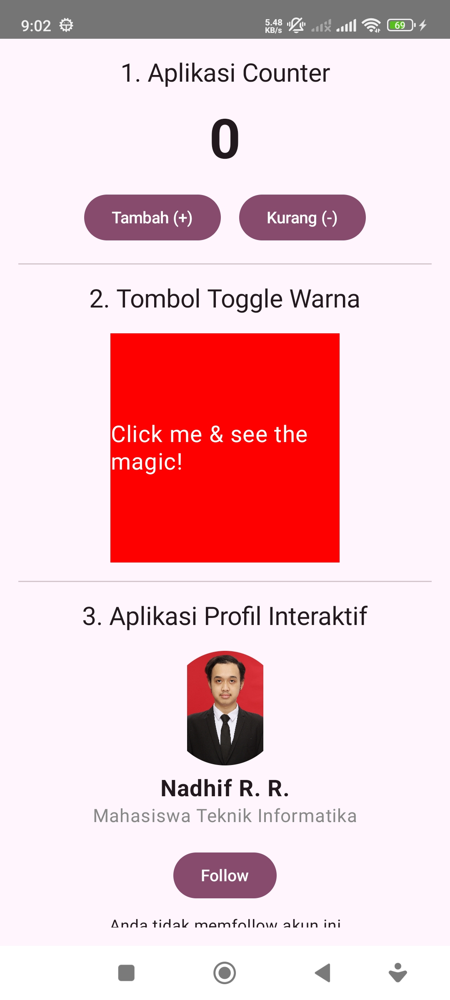
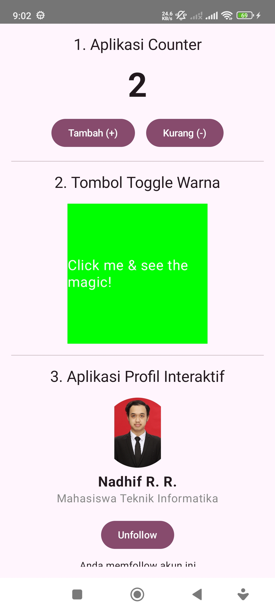

# Praktikum Bab 3: State in Jetpack Compose

Proyek ini adalah implementasi praktikum untuk memahami konsep fundamental **State** dalam Jetpack Compose. Aplikasi ini terdiri dari tiga modul mini yang mendemonstrasikan bagaimana perubahan data (state) secara otomatis memperbarui tampilan (UI) secara reaktif dan efisien.

---

## Tangkapan Layar Aplikasi

Berikut adalah hasil output dari ketiga fitur aplikasi saat dijalankan.

| Default | Color Toggle Button + Followed + Tambah | Unfollow + Kurang |
| :---: | :---: | :---: |
|  |  |  |

---

## Fitur Aplikasi

Aplikasi ini dibagi menjadi tiga bagian utama, masing-masing mendemonstrasikan kasus penggunaan state yang berbeda:

### 1. Aplikasi Counter Plus-Minus
Sebuah counter sederhana dengan dua tombol: **Tambah (+)** dan **Kurang (-)**. Nilai counter disimpan dalam sebuah state dan tidak akan pernah bisa kurang dari nol.

### 2. Tombol Toggle Warna
Sebuah kotak (`Box`) yang warnanya dapat berubah setiap kali diklik. Warna akan bergantian antara **Merah** dan **Hijau**, menunjukkan bagaimana state dapat mengelola atribut UI seperti warna.

### 3. Profil Interaktif
Kartu profil sederhana yang berisi foto, nama, dan deskripsi. Terdapat tombol **Follow/Unfollow** yang teksnya berubah sesuai state. Selain itu, ada juga teks status di bawah tombol yang ikut berubah, memberikan umpan balik langsung kepada pengguna.

---

## Implementasi State

Konsep utama dalam proyek ini adalah manajemen state menggunakan `remember { mutableStateOf(...) }`.

State adalah data yang dapat berubah seiring waktu dan memengaruhi tampilan UI. Dalam aplikasi ini, state diimplementasikan sebagai berikut:

* **Counter App**: Sebuah state `var count by remember { mutableStateOf(0) }` digunakan untuk menyimpan nilai `Int`. UI `Text` "membaca" nilai ini, sementara `Button` bertugas untuk "mengubah" nilainya.
* **Color Toggle Button**: State `var boxColor by remember { mutableStateOf(Color.Red) }` menyimpan objek `Color`. Atribut `background` pada `Box` membaca state ini, dan *event* `clickable` mengubah nilainya.
* **Interactive Profile**: State `var isFollowed by remember { mutableStateOf(false) }` digunakan untuk menyimpan nilai `Boolean`. Teks pada `Button` dan teks status di bawahnya sama-sama membaca state ini untuk menentukan konten apa yang harus ditampilkan.

Setiap kali nilai state diubah (misalnya melalui klik tombol), Jetpack Compose secara otomatis melakukan **recomposition** (menggambar ulang) hanya pada bagian UI yang terpengaruh, membuat pembaruan menjadi sangat efisien.

---

## Analisis: Compose vs. XML Tradisional

Untuk kasus-kasus dalam aplikasi ini, pendekatan Jetpack Compose terasa jauh lebih sederhana dibandingkan dengan menggunakan XML tradisional. Berikut alasannya:

* **Sifat Deklaratif vs. Imperatif**:
    * **XML (Imperatif)**: Anda harus mendefinisikan UI di XML, lalu di file Kotlin/Java, Anda perlu mencari referensi ke setiap `View` (misalnya dengan `findViewById` atau View Binding). Setelah itu, Anda harus secara manual memerintahkan `View` untuk berubah (misalnya, `textView.setText("nilai baru")`).
    * **Compose (Deklaratif)**: Anda hanya perlu **mendeklarasikan** bahwa sebuah `Text` harus menampilkan nilai dari variabel state. Ketika variabel state itu berubah, UI secara otomatis **bereaksi** dan memperbarui dirinya sendiri. Tidak ada lagi perintah manual untuk mengubah properti UI.

* **Kode yang Lebih Ringkas**:
    * Tidak perlu ada file XML terpisah untuk layout. Logika dan tampilan berada di tempat yang sama (file Kotlin), membuat komponen-komponen kecil lebih mudah dikelola.
    * Menghilangkan banyak kode *boilerplate* yang diperlukan untuk menghubungkan XML dengan logika di Kotlin.

* **Manajemen State Terpusat**:
    * Dalam Compose, state menjadi sumber kebenaran tunggal (*single source of truth*). UI adalah cerminan langsung dari state tersebut. Hal ini membuat alur data lebih mudah diprediksi dan di-debug dibandingkan dengan melacak pembaruan manual pada beberapa `View` di XML.
